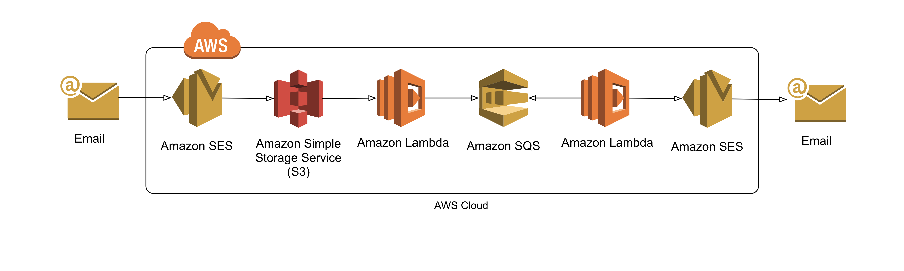

AWS SES Email Receiving
=======================
Setup email receiving and processing for custom domain email addresses setup in AWS.

## Resources
* Domain name (i.e. example.com)
* [Route 53](https://aws.amazon.com/route53/pricing/)
* [S3 Bucket](https://aws.amazon.com/s3/pricing/)
* [Lambda](https://aws.amazon.com/lambda/pricing/)
* [Simple Queue Service (SQS)](https://aws.amazon.com/sqs/pricing/)
* [Simple Email Service (SES)](https://aws.amazon.com/ses/pricing/)
* [Identity Access Management (IAM) Role](https://aws.amazon.com/iam/)
* [CloudWatch Alarm](https://aws.amazon.com/cloudwatch/pricing/)
* [Key Management Service (KMS)](https://aws.amazon.com/kms/pricing/)

## Steps
1. `IAM`: Create an IAM for the future lambda function `parse_email`. Give this role permissions:
    * `AmazonSQSFullAccess`
    * `AmazonS3FullAccess`
    * `CloudWatchFullAccess`
    * `AmazonSESFullAccess`
1. `KMS`: Create a new KMS key, or get the name of an existing KMS key.
1. `SES`: Register domain name. It will give you a `TXT` value. Use `DKIM` and it will generate three `CNAME` values. AWS can add these automatically; or copy the four values for the next step.
1. `Route53`: Create a Hosted Zone for the domain name entered in SES if one does not already exist. Add the four values from SES to Route53 if AWS did not add it automatically.
1. `SES`: Add emails under `Identity Management`.
    * Email with custom domain. This email should auto verify since the domain is registered.
    * Email where the final message will be sent to (like a gmail account). This will need manual verification.
1. `SQS`: Create an SQS topic (Standard) with default settings (or customize as desired). Copy the ARN for later use.
1. `Lambda`: Create two lambda functions:
    * `s3_event_sqs`: s3_event_sqs.py
        * Change: `KMS_KEY_ALIAS`
        * Change: `QUEUE_NAME`
    * `parse_email`: parse_email.py
        * Change: `MY_VERIFIED_EMAIL` (the email the final message is sent to)
        * Change: `EMAIL_BUCKET`
        * Change: `QUEUE_NAME_PREFIX`
    * Use the IAM role created above for both `s3_event_sqs` and `parse_email`
1. `S3`: Create an S3 bucket. Setup the `Events` for the bucket:
    * Name=`sendEventToSQS`
    * Events=`Put`
    * Send To=`Lambda function`
    * Lambda function=`s3_event_sqs`
1. `CloudWatch`: Go to `Event` > `Rules` and create a new rule.
    * Under `Event selector`:
        * Create a `Schedule`
        * Fixed Rate of: `1 minute` or `1 day`
    * Under `Targets`
        * `Lambda function`
        * Function: `parse_email`
    * Follow the prompts on the following pages to save.
1. `SES`: Add a `Rule Set`
    * `Require TLS`
    * `Enable spam and virus scanning`
    * Under `Recipient`, add all recipient emails desired containing the domain registered above.
    * Under `Actions`, `S3`
        * S3 bucket created above
        * Leave the rest blank
1. Send an email to the `Recipient` address added above.
1. (Optional) Setup a CloudWatch alarm to monitor any mass emails being sent to the queue.

## Workflow
1. An email is sent to a domain registered with AWS.
1. SES takes the messages and writes it to S3.
1. That write event triggers a lambda function which pulls only information we need about that event and send is to an SQS queue. Controlling the information sent to SQS guarantees the message is less than 256KB.
1. Depending on the schedule frequency of the second lambda function, it will pickup messages from the queue.
1. The lambda function will process each message it receives and use SES to send the email to the harded coded email in the lambda function.
1. The email should appear in the inbox of the harded coded, verified email address used in the lambda function.

## Note
* To have multiple recipients for emails, you would need to have some kind of key => value mapping.
* If using `1 minute` schedule, that's 43,200 lambda calls in 30 days. With 1,000,000 lambda calls in a free tier, this frequency is free (if other lambda services are not running).
* This setup is practically free for a simple personal use. The biggest cost up front is KMS key and gidomain at about $1-2.
* For an alternate setup, store emails in database and create a front end to view instead of forwarding to another email address.
* To use SES built-in encryption, you must decrypt using an Encryption Client available only in AWS SDK for Java and Ruby.
http://docs.aws.amazon.com/kms/latest/developerguide/services-ses.html#services-ses-decrypt
Because of this restriction, in this code, the lambda function encrypts the file at rest and removes the original during the s3 event message to sqs phase.
